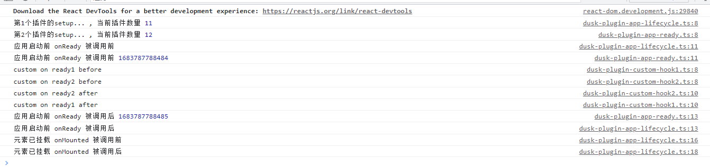

# Dusk

Lightweight frontend framework based on

- [react](https://github.com/facebook/react)
- [redux](https://github.com/reactjs/redux)
- [react-redux](https://github.com/reduxjs/react-redux)
- [redux-thunk](https://github.com/reduxjs/redux-thunk)
- [react-router](https://github.com/remix-run/react-router)
- [hotkeys-js](https://github.com/jaywcjlove/hotkeys)
- [axios](https://github.com/axios/axios)
- [immer](https://github.com/immerjs/immer)

## Features

- Typescript supports
- App lifecycle
- Plugin
- Simplified redux model
- HMR (craco、vite)

## Installation

```
$ npm i @xams-framework/dusk
```

## Usage

- ### Basic ([examples/dusk-example-count](https://github.com/xams-creator/dusk-examples/tree/master/dusk-example-count))
  #### index.tsx
```tsx
    import { createApp, createDuskModel } from '@xams-framework/dusk';

    const app = createApp({
        container: '#root',
    });

    app.define(createDuskModel({
        namespace: 'app',
        initialState: {
            value: 1,
        },
        reducers: {
            add(state) {
                state.value += 1;
            },
        },
    }));

    app.startup(<div>hello world!</div>);

    console.log(app.state);  // {app: {value : 1}}
    app.$store.dispatch({ type: 'app/add' });
    console.log(app.state);  // {app: {value : 2}}


```

- ### Plugins ([examples/dusk-example-plugins](https://github.com/xams-creator/dusk-examples/tree/master/dusk-example-plugins))
  #### index.tsx
```tsx
    import React from 'react';
    import { createApp } from '@xams-framework/dusk';
    import createDuskAppLifecycle from '@/configuration/plugins/dusk-plugin-app-lifecycle';
    import createDuskAppReady from '@/configuration/plugins/dusk-plugin-app-ready';
    import createDuskCustomHooks from '@/configuration/plugins/dusk-plugin-custom-hooks';


    const app = createApp({
        container: '#root',
    });


    app
        .use(createDuskAppLifecycle())
        .use(createDuskAppReady())
        .use(createDuskCustomHooks())
        .startup(<div>按F12请打开控制台</div>)
    ;

    window.app = app;

```



- ### HMR ([examples/dusk-example-hmr-craco](https://github.com/xams-creator/dusk-examples/tree/master/dusk-example-hmr-craco))
```shell
    npm i -D @xams-framework/craco-plugin-dusk-hmr
    npm i @xams-framework/dusk-plugin-hmr
```

- #### craco.config.ts
```tsx
import { CracoConfig } from '@craco/types';
import createCracoDuskHmr from '@xams-framework/craco-plugin-dusk-hmr';

function defineCraco(options: CracoConfig): CracoConfig {
    return options;
}

export default defineCraco({
    plugins: [createCracoDuskHmr()],
    webpack: {
        alias: {
            '@': 'src',
        },
    },
});
```
- #### index.tsx
```tsx
    import React from 'react';
    import { createApp } from '@xams-framework/dusk';
    import createDuskHmr from '@xams-framework/dusk-plugin-hmr';

    const app = createApp({
        container: '#root',
    });

    app
        .use(createDuskHmr())
        .startup()
    ;
```


[comment]: <> (## Api)

[comment]: <> (- ### createApp)

[comment]: <> (- ### createDuskModel)

[comment]: <> (- ### definePlugin)

[comment]: <> (- ### )

[comment]: <> (## Examples)

[comment]: <> (- ### [examples/dusk-example-count]&#40;https://github.com/xams-creator/xams-framework-frontend/tree/master/examples/dusk-example-count&#41;)

[comment]: <> (- ### [examples/dusk-example-routes]&#40;https://github.com/xams-creator/xams-framework-frontend/tree/master/examples/dusk-example-routes&#41;)

[comment]: <> (- ### [examples/dusk-example-styles]&#40;https://github.com/xams-creator/xams-framework-frontend/tree/master/examples/dusk-example-styles&#41;)

[comment]: <> (- ### [examples/dusk-example-plugins]&#40;https://github.com/xams-creator/xams-framework-frontend/tree/master/examples/dusk-example-plugins&#41;)

[comment]: <> (- ### [examples/dusk-example-annotation]&#40;https://github.com/xams-creator/xams-framework-frontend/tree/master/examples/dusk-example-annotation&#41;)

[comment]: <> (- ### [dusk-example-okr]&#40;https://github.com/xams-creator/dusk-example-okr&#41;)

[comment]: <> (  https://xams-creator.github.io/dusk-example-okr/)

[comment]: <> (  ```)

[comment]: <> (  username: dusk)

[comment]: <> (  password: dusk)

[comment]: <> (  ```)

